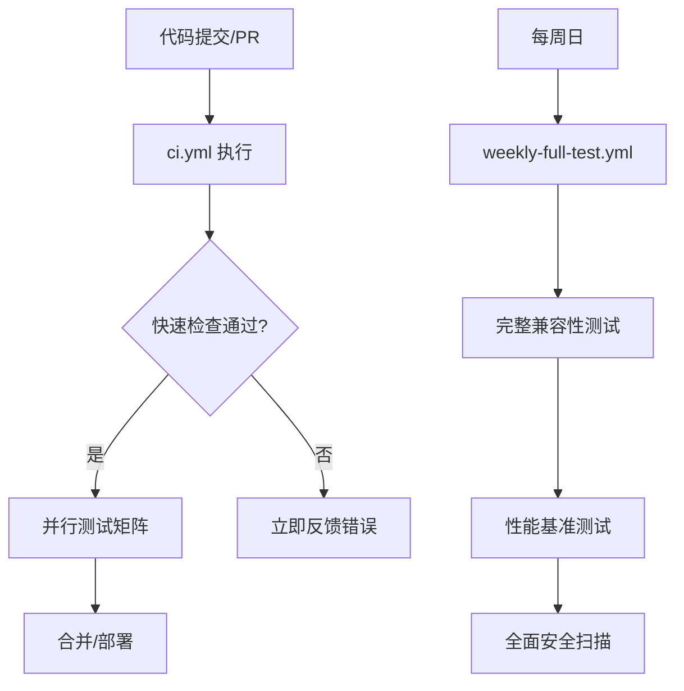

# CI/CD 配置说明

## 📋 **当前 CI 配置文件**

### 🎯 **主要文件**

1. **`ci.yml`** - 主要 CI 流程

   - **触发条件**: 所有 push 和 PR
   - **运行频率**: 每次代码变更
   - **功能**:
     - 快速代码检查（格式、构建、lint）
     - 多版本测试（Go 1.22, 1.23）
     - 数据库兼容性（PostgreSQL 14, 15, 16）
     - 跨平台构建（Linux, Windows, macOS）
     - 条件安全扫描（仅 main 分支）

2. **`weekly-full-test.yml`** - 周度完整测试
   - **触发条件**: 每周日凌晨 2:00 UTC + 手动触发
   - **运行频率**: 每周一次
   - **功能**:
     - 完整矩阵测试（所有 Go 版本 × 所有 PostgreSQL 版本）
     - 全面安全扫描（CodeQL + Gosec）
     - 性能基准测试
     - 详细覆盖率分析

## 🗂️ **已删除的文件**

以下文件已被清理，因为它们是重复或过时的：

- ~~`ci-opensource.yml`~~ - 与 `ci.yml` 重复
- ~~`ci-optimized.yml`~~ - 早期优化版本，已被替代
- ~~`ci-backup.yml`~~ - 原始配置备份，不再需要

## 🚀 **简化后的优势**

1. **清晰明了**: 只有 2 个活跃的 workflow 文件
2. **易于维护**: 减少配置冲突和混淆
3. **目标明确**:
   - `ci.yml` → 快速日常检查
   - `weekly-full-test.yml` → 深度周期检查

## 📊 **CI 执行策略**

## 🔧 **维护指南**

### 日常开发

- 只需关注 `ci.yml` 的检查结果
- PR 合并需要所有必需检查通过
- 性能测试仅在 main 分支运行

### 定期维护

- 查看周度测试报告
- 关注安全扫描结果
- 根据需要调整测试矩阵

### 添加新检查

- 快速检查 → 添加到 `ci.yml`
- 重型检查 → 添加到 `weekly-full-test.yml`
- 实验性检查 → 先在 weekly 中测试

这种简化的配置既保证了代码质量，又提供了良好的开发体验！
