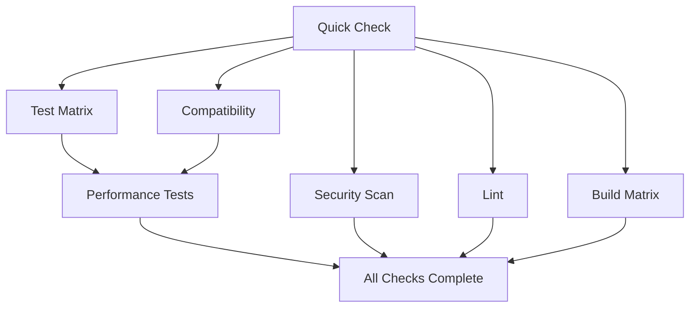

# 开源项目 CI 优化指南

## 🎯 **开源项目 CI 优化目标**

与私有项目不同，开源项目的 CI 优化重点是：

- ✅ **快速反馈** - 让贡献者快速获得代码质量反馈
- ✅ **全面覆盖** - 确保多平台、多版本兼容性
- ✅ **社区友好** - 清晰的错误信息和状态显示
- ✅ **并行执行** - 充分利用 GitHub 免费的并行资源

## 📊 **开源项目 CI 架构设计**

### 🚀 **智能分层架构**



### 🔄 **执行策略**

1. **第一层 - 快速检查** (1-2 分钟)

   - Go 格式检查
   - 依赖验证
   - 基础构建
   - go vet

2. **第二层 - 并行验证** (3-8 分钟)

   - 代码质量检查 (golangci-lint)
   - 测试矩阵 (Go 1.22, 1.23)
   - 兼容性测试 (PostgreSQL 14, 15, 16)
   - 跨平台构建 (Linux, Windows, macOS)

3. **第三层 - 深度检查** (仅 main 分支)
   - 性能测试
   - 安全扫描
   - 基准测试

## ⚡ **优化策略详解**

### 1. **快速失败原则**

```yaml
# 最先运行最可能失败的检查
quick-check:
  - go mod verify # 依赖问题
  - gofmt check # 格式问题
  - go build # 编译问题
  - go vet # 基础代码问题
```

### 2. **智能并行化**

```yaml
# 充分利用GitHub Actions的并行能力
strategy:
  matrix:
    go-version: ['1.22', '1.23'] # Go版本矩阵
    postgres-version: ['14', '15', '16'] # 数据库版本矩阵
    os: [ubuntu, windows, macos] # 操作系统矩阵
```

### 3. **条件执行**

```yaml
# 避免在PR中运行重型任务
if: github.ref == 'refs/heads/main'     # 仅main分支
if: matrix.go-version == '1.23'         # 仅特定版本
```

### 4. **缓存优化**

```yaml
# 最大化缓存利用
- uses: actions/setup-go@v5
  with:
    cache: true # Go模块缓存

# 可选：自定义缓存
- uses: actions/cache@v4
  with:
    path: ~/.cache/golangci-lint
    key: golangci-lint-${{ runner.os }}-${{ hashFiles('**/*.go') }}
```

## 🎨 **PR 检查体验优化**

### ✅ **必需检查** (阻塞合并)

- Quick Check
- Lint
- Test (Go 1.23 + PostgreSQL 16)
- Build (至少 Linux)

### 🔄 **可选检查** (不阻塞合并)

- 兼容性测试
- 跨平台构建
- 性能测试 (仅 main)
- 安全扫描 (仅 main)

### 📋 **状态显示优化**

```yaml
# 清晰的任务命名
name: Test (Go ${{ matrix.go-version }})
name: Compatibility (PostgreSQL ${{ matrix.postgres-version }})
name: Build (${{ matrix.os }})
```

## 🚀 **开源项目特殊优化**

### 1. **多版本支持**

```yaml
# 确保向后兼容性
strategy:
  matrix:
    go-version: ['1.22', '1.23'] # 当前和上一个版本
```

### 2. **跨平台构建**

```yaml
# 确保跨平台兼容性
strategy:
  matrix:
    os: [ubuntu-latest, windows-latest, macos-latest]
```

### 3. **社区友好的错误信息**

```yaml
# 提供清晰的错误信息
- name: Check Go formatting
  run: |
    if [ "$(gofmt -s -l . | wc -l)" -gt 0 ]; then
      echo "The following files are not properly formatted:"
      gofmt -s -l .
      echo "Please run: gofmt -s -w ."
      exit 1
    fi
```

### 4. **文档生成**

```yaml
# 可选：自动生成文档
- name: Generate docs
  run: |
    go install golang.org/x/tools/cmd/godoc@latest
    # 生成API文档
```

## 📈 **性能指标监控**

### 🎯 **关键指标**

- **PR 反馈时间**: 目标 < 5 分钟 (必需检查)
- **完整 CI 时间**: 目标 < 15 分钟 (所有检查)
- **成功率**: 目标 > 95%
- **并行效率**: 最大化并行任务数

### 📊 **监控方法**

```bash
# GitHub CLI 查看运行时间
gh run list --limit 10 --json conclusion,createdAt,updatedAt

# 分析CI瓶颈
gh run view [RUN_ID] --log
```

## 🔧 **进一步优化建议**

### 1. **自定义 Actions**

```yaml
# 创建复合Action减少重复
- uses: ./.github/actions/setup-go-env
  with:
    go-version: ${{ matrix.go-version }}
```

### 2. **预构建镜像**

```dockerfile
# 使用预装Go工具的镜像
FROM golang:1.23-alpine
RUN go install github.com/golangci/golangci-lint/cmd/golangci-lint@latest
```

### 3. **智能触发**

```yaml
# 基于文件变更的智能触发
on:
  push:
    paths:
      - '**.go'
      - 'go.mod'
      - 'go.sum'
      - '.github/workflows/**'
```

### 4. **社区贡献优化**

```yaml
# 为外部贡献者优化
permissions:
  contents: read # 最小权限
  pull-requests: write # 允许评论
```

## 🏆 **最佳实践总结**

1. **快速反馈优先** - 最重要的检查最先运行
2. **并行最大化** - 充分利用免费并行资源
3. **条件执行** - 重型任务只在必要时运行
4. **清晰状态** - 让贡献者容易理解 CI 状态
5. **渐进式检查** - 从快到慢，从简单到复杂
6. **社区友好** - 提供有用的错误信息和修复建议

这种架构既保证了代码质量，又为贡献者提供了良好的开发体验！ 🚀
